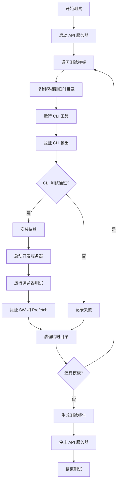

# Design Document

## Overview

综合自动化测试系统采用模块化设计，包含四个主要组件：测试模板管理器、API 服务器、CLI 测试运行器和浏览器自动化测试运行器。系统使用 Node.js 构建，利用 Playwright 进行浏览器自动化，并提供清晰的测试报告和日志输出。

## Architecture

```
test-system/
├── templates/              # 测试项目模板
│   ├── react-cra-no-sw/
│   ├── react-cra-with-sw/
│   ├── react-cra-with-workbox/
│   ├── react-cra-with-prefetch/
│   ├── nextjs-no-sw/
│   ├── nextjs-with-sw/
│   ├── vue3-vite-no-sw/
│   └── react-vite-no-sw/
├── api-server/             # 后端 API 服务器
│   ├── index.js
│   ├── routes/
│   └── middleware/
├── test-runner/            # 测试运行器
│   ├── index.js            # 主测试入口
│   ├── cli-tests.js        # CLI 工具测试
│   ├── browser-tests.js    # 浏览器自动化测试
│   ├── utils/
│   └── reporters/
├── scripts/                # 实用脚本
│   ├── copy-template.js    # 模板复制工具
│   ├── run-demo.js         # Demo 运行工具
│   └── README.md           # 脚本说明
├── demos/                  # 手动测试演示目录
│   ├── README.md           # 使用说明
│   └── [copied-templates]/ # 复制的模板项目
└── test-results/           # 测试结果输出
    ├── logs/
    ├── screenshots/
    └── reports/

test-apps/                  # 自动化测试生成的项目（在根目录）
├── react-cra-no-sw/        # 测试完成后保留，用于调试
├── nextjs-no-sw/
└── ...
```

## Components and Interfaces

### 1. Template Manager

**职责**: 管理测试项目模板的创建、复制和清理

**接口**:
```javascript
class TemplateManager {
  /**
   * 复制模板到临时目录
   * @param {string} templateName - 模板名称
   * @param {string} targetDir - 目标目录
   * @returns {Promise<string>} 临时目录路径
   */
  async copyTemplate(templateName, targetDir);
  
  /**
   * 清理临时测试目录
   * @param {string} dir - 要清理的目录
   * @returns {Promise<void>}
   */
  async cleanup(dir);
  
  /**
   * 获取所有可用模板
   * @returns {Array<string>} 模板名称列表
   */
  getAvailableTemplates();
}
```

### 2. API Server

**职责**: 提供 RESTful API 端点供测试项目使用

**接口**:
```javascript
class APIServer {
  /**
   * 启动 API 服务器
   * @param {number} port - 端口号
   * @returns {Promise<void>}
   */
  async start(port = 3001);
  
  /**
   * 停止 API 服务器
   * @returns {Promise<void>}
   */
  async stop();
  
  /**
   * 获取请求日志
   * @returns {Array<Object>} 请求日志数组
   */
  getRequestLogs();
}
```

**端点设计**:
- `GET /api/products` - 获取产品列表
- `GET /api/products/:id` - 获取单个产品
- `POST /api/products` - 创建产品
- `PUT /api/products/:id` - 更新产品
- `DELETE /api/products/:id` - 删除产品
- `GET /api/users` - 获取用户列表
- `GET /api/health` - 健康检查

### 3. CLI Test Runner

**职责**: 自动化测试 CLI 迁移工具的功能

**接口**:
```javascript
class CLITestRunner {
  /**
   * 运行 CLI 测试套件
   * @param {Array<string>} templates - 要测试的模板列表
   * @returns {Promise<TestResults>}
   */
  async runTests(templates);
  
  /**
   * 测试框架检测
   * @param {string} projectDir - 项目目录
   * @returns {Promise<TestResult>}
   */
  async testFrameworkDetection(projectDir);
  
  /**
   * 测试 Service Worker 检测
   * @param {string} projectDir - 项目目录
   * @returns {Promise<TestResult>}
   */
  async testSWDetection(projectDir);
  
  /**
   * 测试文件生成
   * @param {string} projectDir - 项目目录
   * @returns {Promise<TestResult>}
   */
  async testFileGeneration(projectDir);
  
  /**
   * 测试依赖安装
   * @param {string} projectDir - 项目目录
   * @returns {Promise<TestResult>}
   */
  async testDependencyInstallation(projectDir);
}
```

### 4. Browser Test Runner

**职责**: 使用 Playwright 进行浏览器自动化测试

**接口**:
```javascript
class BrowserTestRunner {
  /**
   * 运行浏览器测试套件
   * @param {string} projectDir - 项目目录
   * @param {string} url - 测试 URL
   * @returns {Promise<TestResults>}
   */
  async runTests(projectDir, url);
  
  /**
   * 测试 Service Worker 注册
   * @param {Page} page - Playwright 页面对象
   * @returns {Promise<TestResult>}
   */
  async testSWRegistration(page);
  
  /**
   * 测试 prefetch 功能
   * @param {Page} page - Playwright 页面对象
   * @returns {Promise<TestResult>}
   */
  async testPrefetchFunctionality(page);
  
  /**
   * 测试缓存功能
   * @param {Page} page - Playwright 页面对象
   * @returns {Promise<TestResult>}
   */
  async testCacheFunctionality(page);
  
  /**
   * 捕获网络活动
   * @param {Page} page - Playwright 页面对象
   * @returns {Promise<Array<Request>>}
   */
  async captureNetworkActivity(page);
}
```

### 5. Test Reporter

**职责**: 生成测试报告和日志

**接口**:
```javascript
class TestReporter {
  /**
   * 生成测试报告
   * @param {TestResults} results - 测试结果
   * @returns {Promise<void>}
   */
  async generateReport(results);
  
  /**
   * 保存测试日志
   * @param {string} testName - 测试名称
   * @param {Array<string>} logs - 日志内容
   * @returns {Promise<void>}
   */
  async saveLogs(testName, logs);
  
  /**
   * 保存截图
   * @param {string} testName - 测试名称
   * @param {Buffer} screenshot - 截图数据
   * @returns {Promise<void>}
   */
  async saveScreenshot(testName, screenshot);
  
  /**
   * 生成 JSON 报告
   * @param {TestResults} results - 测试结果
   * @returns {Promise<void>}
   */
  async generateJSONReport(results);
}
```

## Data Models

### TestResult
```typescript
interface TestResult {
  name: string;           // 测试名称
  status: 'pass' | 'fail' | 'skip';
  duration: number;       // 执行时间（毫秒）
  error?: Error;          // 错误信息（如果失败）
  logs: string[];         // 测试日志
  metadata?: {            // 额外元数据
    framework?: string;
    hasServiceWorker?: boolean;
    hasWorkbox?: boolean;
    hasPrefetch?: boolean;
  };
}
```

### TestResults
```typescript
interface TestResults {
  total: number;          // 总测试数
  passed: number;         // 通过数
  failed: number;         // 失败数
  skipped: number;        // 跳过数
  duration: number;       // 总执行时间
  timestamp: string;      // 测试时间戳
  results: TestResult[];  // 详细结果
}
```

### TemplateConfig
```typescript
interface TemplateConfig {
  name: string;           // 模板名称
  framework: string;      // 框架类型
  hasServiceWorker: boolean;
  hasWorkbox: boolean;
  hasPrefetch: boolean;
  entryFile: string;      // 入口文件路径
  publicDir: string;      // 公共目录路径
}
```

## Error Handling

### 错误类型

1. **TemplateError**: 模板相关错误（复制失败、模板不存在等）
2. **CLIError**: CLI 工具执行错误
3. **BrowserError**: 浏览器自动化错误
4. **ServerError**: API 服务器错误

### 错误处理策略

1. **优雅降级**: 单个测试失败不应影响其他测试
2. **详细日志**: 记录完整的错误堆栈和上下文信息
3. **自动清理**: 即使测试失败也要清理临时文件
4. **重试机制**: 对于网络相关的测试，实现重试逻辑（最多 3 次）
5. **超时控制**: 为每个测试设置合理的超时时间

```javascript
class TestError extends Error {
  constructor(message, context) {
    super(message);
    this.name = this.constructor.name;
    this.context = context;
    this.timestamp = new Date().toISOString();
  }
}

// 错误处理包装器
async function withErrorHandling(testFn, testName) {
  try {
    return await testFn();
  } catch (error) {
    console.error(`Test "${testName}" failed:`, error);
    return {
      name: testName,
      status: 'fail',
      error: error,
      logs: [error.message, error.stack]
    };
  }
}
```

## Testing Strategy

### 测试层级

1. **单元测试**: 测试各个组件的独立功能
   - Template Manager 的复制和清理功能
   - API Server 的路由处理
   - Test Reporter 的报告生成

2. **集成测试**: 测试组件之间的交互
   - CLI 工具与测试项目的集成
   - 浏览器测试与 API 服务器的交互

3. **端到端测试**: 完整的测试流程
   - 从模板复制到浏览器验证的完整流程

### 测试执行流程



### 测试场景矩阵

| 框架 | 无 SW | 有 SW | 有 Workbox | 已有 Prefetch |
|------|-------|-------|------------|---------------|
| React CRA | ✓ | ✓ | ✓ | ✓ |
| Next.js | ✓ | ✓ | - | - |
| Vue 3 Vite | ✓ | - | - | - |
| React Vite | ✓ | - | - | - |

### 性能考虑

1. **并行执行**: CLI 测试可以并行运行（不同模板）
2. **浏览器复用**: 浏览器测试使用同一个浏览器实例
3. **缓存优化**: 避免重复安装依赖
4. **超时设置**: 
   - CLI 测试: 60 秒
   - 依赖安装: 120 秒
   - 浏览器测试: 30 秒

## Implementation Notes

### 技术栈

- **Node.js**: 运行时环境
- **Playwright**: 浏览器自动化
- **Express**: API 服务器框架
- **fs-extra**: 文件系统操作
- **chalk**: 终端输出美化
- **execa**: 进程执行

### 目录结构

```
test-system/
├── package.json
├── README.md
├── .gitignore
├── templates/
│   └── [各种测试模板]
├── api-server/
│   ├── index.js
│   ├── routes/
│   │   ├── products.js
│   │   └── users.js
│   └── middleware/
│       ├── cors.js
│       └── logger.js
├── test-runner/
│   ├── index.js              # 主入口
│   ├── cli-tests.js
│   ├── browser-tests.js
│   ├── utils/
│   │   ├── template-manager.js
│   │   ├── process-runner.js
│   │   └── file-checker.js
│   └── reporters/
│       ├── console-reporter.js
│       └── json-reporter.js
└── test-results/
    ├── logs/
    ├── screenshots/
    └── reports/
```

### 配置文件

```javascript
// test-config.js
module.exports = {
  apiServer: {
    port: 3001,
    host: 'localhost'
  },
  browser: {
    headless: true,
    slowMo: 0,
    timeout: 30000
  },
  cli: {
    timeout: 60000,
    skipInstall: false  // 开发时可设为 true
  },
  templates: {
    baseDir: './templates',
    tempDir: './test-results/temp'
  },
  reporting: {
    outputDir: './test-results',
    verbose: true,
    saveScreenshots: true
  }
};
```

## Test Project Management

### Test Apps Directory

自动化测试生成的项目保存在 `test-apps/` 目录（项目根目录）：

**特点**:
- 测试运行开始时，如果目录已存在则先清理
- 测试完成后保留项目，不删除
- 开发者可以查看测试后的项目状态
- 用于调试和验证测试结果

**目录结构**:
```
test-apps/
├── react-cra-no-sw/        # 测试后的 React CRA 项目
├── nextjs-no-sw/           # 测试后的 Next.js 项目
├── vue3-vite-no-sw/        # 测试后的 Vue 3 项目
└── ...                     # 其他测试项目
```

**配置**:
```javascript
// test-config.js
templates: {
  baseDir: './templates',
  tempDir: '../test-apps'  // 保存到根目录的 test-apps
}
```

### Demos Directory

手动测试演示目录 `test-system/demos/`：

**用途**:
- 工具开发者手动测试
- 快速复制模板进行开发
- 验证 CLI 工具功能
- 测试浏览器功能

**复制工具**:
```bash
# 复制单个模板
node demos/copy-template.js react-cra-no-sw

# 复制所有模板
node demos/copy-template.js all

# 查看可用模板
node demos/copy-template.js list
```

**特点**:
- 自动复制 API 服务器
- 自动复制指定模板
- 提供使用说明
- 不被 git 跟踪

**工作流程**:
1. 复制模板到 demos 目录
2. 启动 API 服务器（demos/api-server）
3. 启动模板项目（demos/<template-name>）
4. 手动测试和开发
5. 使用 workspace 依赖自动获取最新代码

### Directory Comparison

| 目录 | 用途 | 生成方式 | 保留策略 | Git 跟踪 |
|------|------|----------|----------|----------|
| `templates/` | 标准测试模板 | 手动创建 | 永久保留 | ✅ 跟踪 |
| `test-apps/` | 自动化测试项目 | 自动生成 | 测试后保留 | ❌ 忽略 |
| `demos/` | 手动测试项目 | 手动复制 | 手动管理 | ❌ 忽略 |

## Monorepo Integration

### Workspace Configuration

test-system 已集成到 pnpm monorepo：

**pnpm-workspace.yaml**:
```yaml
packages:
  - 'packages/*'
  - 'demos/**'
  - 'test-system'  # 新增
```

**package.json (test-system)**:
```json
{
  "name": "@norejs/test-system",
  "dependencies": {
    "@norejs/prefetch": "workspace:*",
    "@norejs/prefetch-worker": "workspace:*"
  }
}
```

### Benefits

1. **使用最新代码**: 始终使用 workspace 中最新的 prefetch 包
2. **无需发布**: 不需要发布到 npm 就能测试
3. **快速迭代**: 修改代码后立即可以测试
4. **统一管理**: 与其他包一起管理依赖

### Scripts

**根目录脚本**:
```bash
pnpm test              # 运行完整测试
pnpm test:quick        # 快速测试
pnpm test:single       # 测试单个模板
```

**test-system 脚本**:
```bash
pnpm demo:copy         # 复制模板到 demos
pnpm demo:list         # 列出可用模板
pnpm demo:all          # 复制所有模板
pnpm clean:demos       # 清理 demos 目录
pnpm clean:test-apps   # 清理 test-apps 目录
```
