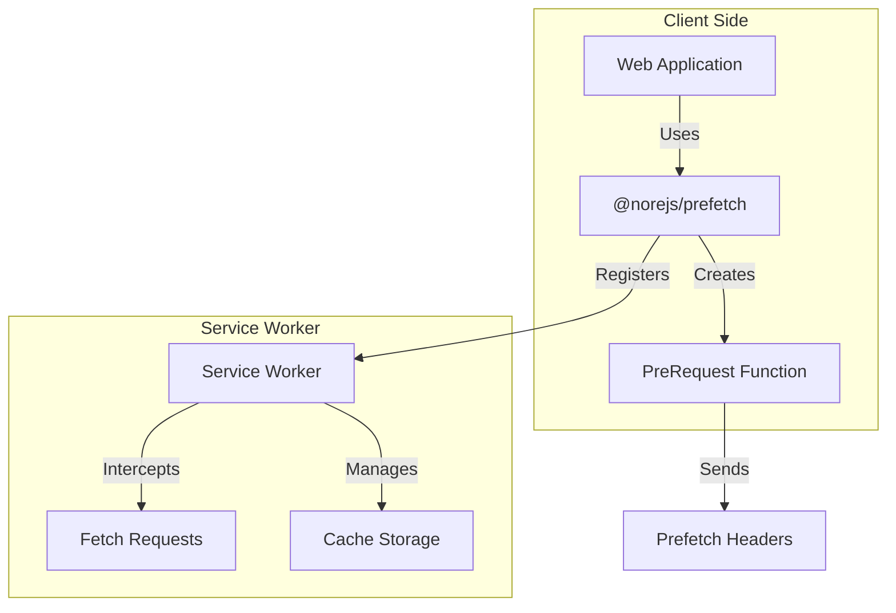

# Prefetch

🚀 **跨应用数据预请求方案**

[](https://www.npmjs.com/package/@norejs/prefetch)
[](https://opensource.org/licenses/MIT)
[](https://www.typescriptlang.org/)

[English](README.md) | [中文](README.zh-CN.md)

## 🎯 什么是 Prefetch？

Prefetch 是一个智能的数据预请求方案，利用 Service Worker 技术缓存 API 请求并提供即时响应。通过在用户真正需要数据之前预加载，显著提升用户体验。

## ✨ 核心特性

- 🔄 **请求去重**: 自动合并相同的并发请求
- 📦 **智能缓存**: 支持预请求和普通请求的统一缓存机制
- ⚡ **性能优化**: Promise 级别的请求复用
- 🎛️ **灵活配置**: 支持消息初始化和默认配置
- 🔧 **动态劫持**: fetch 事件监听器在脚本初始化时注册，通过函数变量实现动态处理
- 🐛 **开发友好**: 详细的日志输出和调试支持
- 🌐 **跨应用支持**: 支持多应用场景
- ⚛️ **React 集成**: 内置 React 组件和钩子

## 📊 与其他方案对比

| 特性 | **我们的方案** | React Query/SWR | Workbox | quicklink | instant.page | 浏览器预取 |
|------|----------------|------------------|---------|-----------|--------------|------------|
| **主要用途** | API 数据预请求 | 数据获取和缓存 | SW 工具包 | 链接预取 | 页面预取 | 资源预取 |
| **实现方式** | Service Worker + 统一 API | 客户端钩子 | 手动 SW 设置 | DOM 观察 | 悬停/视口检测 | HTML `<link>` 标签 |
| **缓存策略** | 多级智能缓存 | 内存 + 可选持久化 | 手动缓存策略 | 仅浏览器缓存 | 仅浏览器缓存 | 仅浏览器缓存 |
| **请求去重** | ✅ 自动 | ✅ 内置 | ❌ 手动 | ❌ 无 | ❌ 无 | ❌ 无 |
| **跨域支持** | ✅ 可配置 | ✅ 内置 | ✅ 手动设置 | ✅ 有限 | ✅ 有限 | ✅ 基础 |
| **框架无关** | ✅ 任何框架 | ❌ React/Vue 专用 | ✅ 任何框架 | ✅ 任何框架 | ✅ 任何框架 | ✅ 任何框架 |
| **TypeScript 支持** | ✅ 完整支持 | ✅ 完整支持 | ✅ 完整支持 | ❌ 有限 | ❌ 基础 | ❌ 无 |
| **包大小** | 🟡 ~15KB (含 SW) | 🟡 ~13KB | 🔴 ~25KB+ | 🟢 ~2KB | 🟢 ~1KB | 🟢 0KB |
| **设置复杂度** | 🟢 简单 CLI + API | 🟡 封装器设置 | 🔴 复杂 SW 配置 | 🟢 即插即用脚本 | 🟢 即插即用脚本 | 🟢 HTML 标签 |
| **数据 vs 资源** | ✅ API 数据专注 | ✅ 数据专注 | 🟡 两者兼顾(手动) | ❌ 仅资源 | ❌ 仅页面 | ❌ 仅资源 |
| **缓存持久化** | ✅ Service Worker 缓存 | 🟡 内存/localStorage | ✅ SW 缓存 | ❌ 浏览器缓存 | ❌ 浏览器缓存 | ❌ 浏览器缓存 |
| **离线支持** | ✅ 内置 | ❌ 需额外设置 | ✅ 内置 | ❌ 无 | ❌ 无 | ❌ 无 |
| **调试工具** | ✅ 内置日志 | ✅ 开发工具 | 🟡 手动设置 | ❌ 有限 | ❌ 有限 | ❌ 无 |
| **跨应用共享** | ✅ 内置 | ❌ 应用专用 | 🟡 手动设置 | ❌ 无 | ❌ 无 | ❌ 无 |
| **Promise 共享** | ✅ 自动 | ✅ 按钩子 | ❌ 手动 | ❌ 无 | ❌ 无 | ❌ 无 |

### 🏆 核心优势

1. **🎯 专为 API 而生**: 不同于通用解决方案，专门为 API 数据预请求设计
2. **🔄 智能去重**: 自动防止重复请求，在应用间共享 Promise
3. **⚡ 零配置**: 开箱即用，具有合理的默认设置，无需复杂配置
4. **🌐 跨应用**: 在同域的不同应用间共享缓存数据
5. **🛠️ 开发体验**: 简单的 CLI 安装、TypeScript 优先的 API 和优秀的调试工具
6. **📦 一体化解决方案**: 无需组合多个库 - 一个包满足所有数据预请求需求
7. **🔧 Service Worker 能力**: 利用 SW 功能实现真正的网络级缓存和离线支持

### 🤔 何时选择我们的方案

**选择 Prefetch 当你需要:**
- API 数据预请求（不仅仅是页面/资源预请求）
- 跨应用数据共享
- 最小化设置复杂度
- 框架无关的解决方案
- 内置离线支持
- 高级请求去重

**考虑其他方案当:**
- 只需要页面/资源预请求（使用 quicklink/instant.page）
- 构建仅 React 应用且有复杂数据需求（React Query 可能足够）
- 需要完整的 PWA 工具包（Workbox 提供更全面的 SW 功能）
- 包大小至关重要且只需基础预请求功能

## 📦 系统架构

Prefetch 是一个统一的解决方案，包含：

- **Service Worker 管理**: 自动注册和生命周期处理
- **预请求 API**: 简单的 `createPreRequest()` 函数用于数据预取
- **React 集成**: 内置 `PrefetchLink` 组件
- **智能缓存**: 自动请求去重和缓存管理
- **配置**: 灵活的设置和合理的默认值



## 🚀 快速开始

### 安装

```bash
# 安装 Prefetch（包含所有必需的功能）
npm install @norejs/prefetch
```

### 设置 Service Worker

```bash
# 复制 service worker 文件到 public 目录
npx prefetch install --dir public
```

### 基本用法

```typescript
import { setup, createPreRequest } from '@norejs/prefetch'

// 初始化预请求方案
await setup({
  serviceWorkerUrl: '/service-worker.js',
  scope: '/',
  apiMatcher: '/api',           // API 匹配规则
  defaultExpireTime: 30000,     // 默认过期时间 30 秒
  maxCacheSize: 100,            // 最大缓存数量
  debug: true                   // 开启调试模式
})

// 创建预请求函数
const preRequest = createPreRequest()

// 预请求数据
await preRequest('/api/products', {
  expireTime: 30000  // 自定义过期时间
})

// 实际请求时会从缓存返回（如果可用）
const response = await fetch('/api/products')
```

### React 集成

```jsx
import { PrefetchLink } from '@norejs/prefetch'

function App() {
  return (
    <PrefetchLink appUrl="https://example.com">
      <a href="/products">产品</a>
    </PrefetchLink>
  )
}
```

## ⚙️ 配置选项

| 参数 | 类型 | 默认值 | 说明 |
|------|------|--------|------|
| `serviceWorkerUrl` | `string` | - | Service Worker 文件路径 |
| `scope` | `string` | `'/'` | Service Worker 作用域 |
| `apiMatcher` | `string \| RegExp` | `'/api'` | API 请求匹配规则 |
| `defaultExpireTime` | `number` | `0` | 默认缓存过期时间（毫秒） |
| `maxCacheSize` | `number` | `100` | 最大缓存数量 |
| `debug` | `boolean` | `false` | 是否开启调试模式 |

## 🔍 工作原理

### 1. 动态劫持机制

```typescript
// Service Worker 在脚本评估阶段注册 fetch 监听器
self.addEventListener('fetch', function (event) {
    if (!isInitialized || !handleFetchEventImpl) {
        return; // 不拦截
    }
    // 动态调用处理函数
    event.respondWith(handleFetchEventImpl(event));
});

// 处理函数在初始化时设置
handleFetchEventImpl = setupWorker(config);
```

### 2. 智能缓存策略

**支持的 HTTP 方法：**
- ✅ **GET**: 查询操作，适合缓存
- ✅ **POST**: 提交操作，支持请求去重
- ✅ **PATCH**: 更新操作，支持缓存
- ❌ **DELETE**: 删除操作，永远不会被缓存

### 3. 请求去重机制

```typescript
// 两级缓存设计
type ICacheItem = {
    expire: number;
    response?: Response;        // 已完成的响应
    requestPromise?: Promise<Response>; // 进行中的请求
};
```

**缓存流程：**
1. **缓存命中**：直接返回已缓存的 Response
2. **Promise 复用**：多个相同请求共享同一个 Promise
3. **新建请求**：创建新的网络请求并缓存 Promise

### 4. 预请求标识

预请求通过特殊请求头标识：
```
X-Prefetch-Request-Type: prefetch
X-Prefetch-Expire-Time: 30000
```

## 📊 性能优势

1. **首次访问**：预请求在后台加载数据
2. **后续访问**：从缓存中即时获取数据
3. **智能缓存**：避免重复请求和存储
4. **自动清理**：防止缓存无限增长

## 🛠️ 高级用法

### 自定义请求匹配

```typescript
await setup({
  serviceWorkerUrl: '/service-worker.js',
  apiMatcher: /\/api\/v[12]\//,  // 匹配 /api/v1/ 和 /api/v2/
  // ... 其他选项
})
```

### 手动发送 Service Worker 消息

```typescript
// 手动发送初始化消息
navigator.serviceWorker.controller.postMessage({
  type: 'PREFETCH_INIT',
  config: {
    apiMatcher: '/api/v1',
    defaultExpireTime: 60000,
    maxCacheSize: 200,
    debug: false
  }
})
```

## 🧪 演示项目

我们提供了完整的演示项目来展示预请求方案：

```bash
# 安装所有演示项目的依赖
npm run demo:install

# 复制 Service Worker 文件（使用新的统一 CLI）
npm run demo:copy-sw

# 运行 API 服务器
npm run demo:api

# 运行 Next.js 演示
npm run demo:nextjs

# 运行 Vite 演示
npm run demo:vite

# 同时运行所有演示
npm run demo:start:all
```

**注意**: 演示项目使用新的统一 `prefetch` CLI 命令，展示了简化的安装流程。

访问地址：
- **API 服务器**: http://localhost:3001
- **Next.js 演示**: http://localhost:3000
- **Vite 演示**: http://localhost:5173

## ⚠️ 注意事项

1. **HTTPS 要求**: Service Worker 只能在 HTTPS 或 localhost 下运行
2. **浏览器支持**: 需要支持 Service Worker 的现代浏览器
3. **同源策略**: 预请求只能在同源请求下工作
4. **缓存限制**: 默认最大缓存 100 个请求

## 🤝 贡献

我们欢迎贡献！请查看我们的[贡献指南](CONTRIBUTING.md)了解详情。

## 📄 许可证

本项目基于 MIT 许可证 - 查看 [LICENSE](LICENSE) 文件了解详情。

## 📚 额外资源

- [API 文档](docs/API.md)
- [迁移指南](MIGRATION.md)
- [性能基准](docs/BENCHMARKS.md)
- [故障排除](docs/TROUBLESHOOTING.md)

## 🔗 相关项目

- [Service Worker API](https://developer.mozilla.org/en-US/docs/Web/API/Service_Worker_API)
- [Fetch API](https://developer.mozilla.org/en-US/docs/Web/API/Fetch_API)
- [Web App Manifest](https://developer.mozilla.org/en-US/docs/Web/Manifest)
