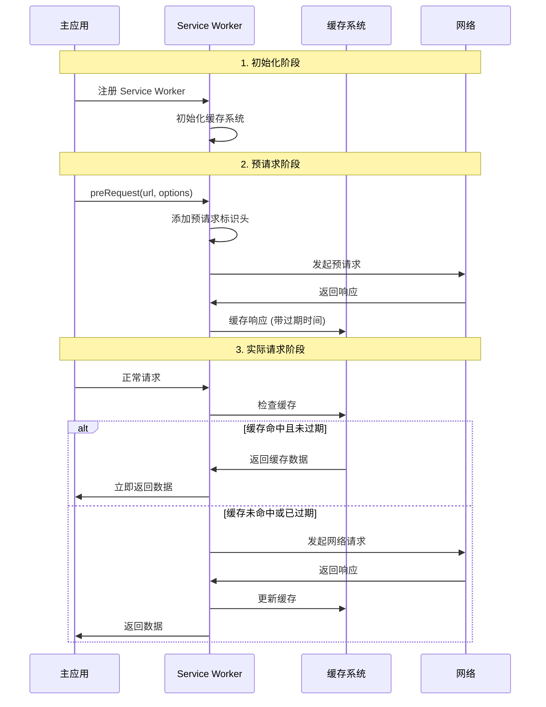

# Prefetch 技术文档

## 📖 项目概述

Prefetch 是一个基于 Service Worker 的跨应用数据预请求系统，旨在通过提前加载数据和资源来显著提升用户体验。该项目采用 monorepo 架构，提供了完整的预请求解决方案。

## 🎯 核心价值

- **性能提升**: 通过预先加载减少用户等待时间
- **跨应用支持**: 支持微前端场景下的应用间资源预加载
- **智能缓存**: 基于规则的智能缓存管理
- **类型安全**: 完整的 TypeScript 支持

## 🏗️ 架构设计

### 整体架构图

```mermaid
graph TB
    subgraph "Browser Environment"
        A[Main Application] --> B[Service Worker]
        A --> C[Prefetch Cache]
        B --> D[Network Requests]
        B --> C
    end
    
    subgraph "Prefetch Packages"
        E[@norejs/prefetch<br/>核心包] --> F[prefetch-worker<br/>SW实现]
        E --> G[swiftcom<br/>通信层]
        F --> B
        G --> H[Main ↔ Worker Communication]
    end
    
    A --> E
    H --> A
    H --> B
```

### 核心组件

#### 1. @norejs/prefetch (核心包)
负责提供预请求的主要功能和 API。

**主要模块:**
- `setup.ts`: 初始化 Service Worker
- `preRequest.ts`: 预请求函数实现
- `PrefetchLink`: React 组件，用于应用级预加载
- `runAppPfetchScript.ts`: 跨应用资源预加载
- `loadManifest.ts`: 资源清单解析

#### 2. prefetch-worker (Service Worker 包)
Service Worker 的核心实现，负责网络拦截和缓存管理。

**核心功能:**
- 网络请求拦截
- 智能缓存策略
- 请求匹配规则
- 缓存键生成

#### 3. swiftcom (通信包)
专门处理主线程与 Service Worker 之间的双向通信。

**特性:**
- 类型安全的 RPC 调用
- 自动重连机制
- 状态管理

## 🔧 工作原理详解

### 1. 预请求流程



### 2. 缓存策略

#### 缓存键生成
```typescript
// 基于 URL + Method + Body 生成唯一缓存键
const cacheKey = sha256(`${method.toUpperCase()} ${url} ${JSON.stringify(body)}`);
```

#### 缓存管理
- **过期控制**: 通过 `X-Prefetch-Expire-Time` 头设置过期时间
- **容量限制**: 默认最大缓存 100 个条目
- **LRU 清理**: 自动清理过期缓存

### 3. 请求识别机制

Service Worker 通过特殊请求头识别预请求：

```typescript
// 预请求标识
headers: {
  'X-Prefetch-Request-Type': 'prefetch',
  'X-Prefetch-Expire-Time': '5000'
}
```

### 4. 跨应用预加载

通过 iframe 沙箱安全地预加载外部应用资源：

```typescript
// 创建隔离的 iframe 环境
const iframe = document.createElement("iframe");
iframe.sandbox.add("allow-scripts");
iframe.sandbox.add("allow-same-origin");

// 解析目标应用的资源清单
const manifest = await loadManifest(appUrl);
const { prefetchLinks, preScripts } = manifest;

// 在沙箱中预加载资源
prefetchLinks.forEach(link => {
  const linkElement = iframeDocument.createElement("link");
  linkElement.rel = "prefetch";
  linkElement.href = link;
  iframeDocument.head.appendChild(linkElement);
});
```

## 🚀 使用指南

### 基础使用

#### 1. 安装和初始化

```typescript
import { setup, preRequest } from '@norejs/prefetch';

// 初始化 Service Worker
await setup({
  serviceWorkerUrl: '/prefetch-worker/service-worker.js',
  scope: '/'
});

// 创建预请求函数
const prefetchFn = preRequest();
```

#### 2. 执行预请求

```typescript
// 预请求 API 数据
await prefetchFn('/api/user/profile', {
  expireTime: 10000 // 10秒过期
});

// 后续的实际请求将从缓存中获取数据
const userProfile = await fetch('/api/user/profile');
```

#### 3. React 组件使用

```jsx
import { PrefetchLink } from '@norejs/prefetch';

function App() {
  return (
    <PrefetchLink appUrl="https://app.example.com">
      <button>加载应用</button>
    </PrefetchLink>
  );
}
```

### 高级配置

#### Service Worker 配置

```typescript
// packages/prefetch-worker/src/index.ts
setupWorker({
  apiMatcher: /\/api\//, // 匹配需要缓存的 API
  maxCacheSize: 200,     // 最大缓存数量
  defaultExpireTime: 30000, // 默认过期时间
  debug: true            // 开启调试模式
});
```

## 🔍 项目现状分析

### ✅ 已完成功能

1. **基础预请求**: 基本的预请求和缓存功能已实现
2. **Service Worker 集成**: SW 注册、拦截、缓存机制完整
3. **跨应用预加载**: iframe 沙箱和资源清单解析
4. **通信系统**: 主线程与 SW 的双向通信
5. **TypeScript 支持**: 完整的类型定义

### ⚠️ 未完成/需改进部分

#### 1. 规则系统不完整
**问题**: `IRule` 接口定义完整，但缺少实际使用
```typescript
// 已定义但未使用的规则接口
interface IRule {
  apiUrl: string;
  type: "POST" | "GET" | "PUT" | "DELETE";
  expireTime?: number;
  triger?: "idle" | "click" | "visible"; // 触发器未实现
  requestParams: IRequestParams | (() => Promise<IRequestParams>);
  fetch?: (params: IRequestParams) => Promise<Response>;
  validateCache?: (cache: ICache) => boolean;
}
```

**影响**: 无法基于规则自动触发预请求

#### 2. 触发器机制缺失
**问题**: 定义了 `idle`、`click`、`visible` 触发器，但没有实现
**需要补充**:
- Intersection Observer API (可见性触发)
- 空闲时间检测 (requestIdleCallback)
- 事件监听器绑定

#### 3. swiftcom 包集成度低
**问题**: swiftcom 通信包功能完整，但与 prefetch 核心功能集成不够
**建议**: 用于规则动态配置、缓存状态查询等

#### 4. 错误处理和监控
**缺失**:
- 详细的错误分类和处理
- 性能监控指标
- 缓存命中率统计

#### 5. 文档和示例
**缺失**:
- 完整的使用示例
- 最佳实践指南
- 性能优化建议

## 💡 完善建议

### 1. 实现完整的规则系统

```typescript
// 建议的规则管理器
class PrefetchRuleManager {
  private rules: Map<string, IRule> = new Map();
  
  addRule(rule: IRule): string {
    const key = this.generateRuleKey(rule);
    this.rules.set(key, rule);
    this.setupTrigger(rule);
    return key;
  }
  
  private setupTrigger(rule: IRule) {
    switch (rule.triger) {
      case 'visible':
        this.setupIntersectionObserver(rule);
        break;
      case 'idle':
        this.setupIdleCallback(rule);
        break;
      case 'click':
        this.setupClickListener(rule);
        break;
    }
  }
}
```

### 2. 增强监控和统计

```typescript
// 建议的监控系统
interface PrefetchMetrics {
  cacheHitRate: number;
  averageResponseTime: number;
  totalPrefetchCount: number;
  errorRate: number;
}

class PrefetchMonitor {
  getMetrics(): PrefetchMetrics;
  trackCacheHit(url: string): void;
  trackCacheMiss(url: string): void;
  trackError(error: Error): void;
}
```

### 3. 优化 Service Worker 生命周期

```typescript
// 建议增加的功能
class ServiceWorkerManager {
  async updateWorker(): Promise<void>;
  async clearCache(): Promise<void>;
  getWorkerStatus(): WorkerStatus;
  onWorkerUpdate(callback: () => void): void;
}
```

### 4. 增加配置系统

```typescript
// 建议的配置接口
interface PrefetchConfig {
  // 缓存配置
  cache: {
    maxSize: number;
    defaultExpireTime: number;
    storageQuota: number;
  };
  
  // 网络配置
  network: {
    timeout: number;
    retryAttempts: number;
    concurrentLimit: number;
  };
  
  // 监控配置
  monitoring: {
    enabled: boolean;
    reportInterval: number;
    metricsEndpoint?: string;
  };
}
```

## 🛠️ 开发指南

### 本地开发

```bash
# 安装依赖
pnpm install

# 启动开发模式
pnpm start

# 构建项目
pnpm build

# 运行测试
pnpm test
```

### 项目结构

```
prefetch/
├── packages/
│   ├── prefetch/           # 核心包
│   │   ├── src/
│   │   │   ├── core/      # 核心功能
│   │   │   ├── react/     # React 组件
│   │   │   ├── utils/     # 工具函数
│   │   │   └── interfaces/ # 类型定义
│   │   └── package.json
│   ├── prefetch-worker/    # Service Worker
│   │   ├── src/
│   │   │   ├── setup.ts   # SW 核心逻辑
│   │   │   └── utils/     # SW 工具函数
│   │   └── package.json
│   └── swiftcom/          # 通信包
│       ├── src/
│       │   ├── main/      # 主线程端
│       │   └── worker/    # Worker 端
│       └── package.json
├── demos/                 # 示例项目
├── turbo.json            # Turbo 配置
└── pnpm-workspace.yaml   # Workspace 配置
```

## 🔮 未来规划

### 短期目标 (1-2 个月)
1. 完善规则系统和触发器
2. 增加性能监控和统计
3. 完善错误处理机制
4. 补充文档和示例

### 中期目标 (3-6 个月)
1. 支持更多缓存策略 (LRU, LFU 等)
2. 增加离线支持
3. 支持更多框架 (Vue, Angular)
4. 性能优化和内存管理

### 长期目标 (6+ 个月)
1. 智能预测算法
2. 分布式缓存支持
3. 云端缓存同步
4. AI 驱动的预加载决策

## 📊 性能指标

### 预期性能提升
- **首屏加载时间**: 减少 30-50%
- **页面切换时间**: 减少 60-80%
- **API 响应时间**: 缓存命中时接近 0ms
- **用户感知延迟**: 显著降低

### 资源消耗
- **内存占用**: 预计 5-10MB (缓存 100 条记录)
- **存储空间**: 可配置，默认 50MB
- **CPU 开销**: 微乎其微 (主要是异步操作)

## 🤝 贡献指南

1. Fork 项目
2. 创建特性分支: `git checkout -b feature/amazing-feature`
3. 提交更改: `git commit -m 'Add amazing feature'`
4. 推送分支: `git push origin feature/amazing-feature`
5. 提交 Pull Request

## 📄 许可证

本项目采用 ISC 许可证 - 查看 [LICENSE](LICENSE) 文件了解详情。

---

**注意**: 本项目目前处于开发阶段，部分功能尚未完全实现。欢迎贡献代码和提出改进建议！
