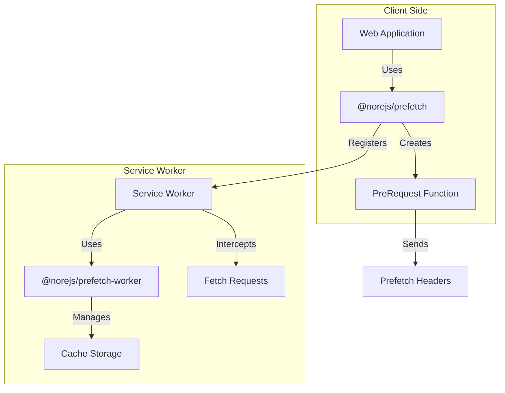

# Prefetch

🚀 **Cross-Application Data Prefetching System** | **跨应用数据预请求系统**

[](https://www.npmjs.com/package/@norejs/prefetch)
[](https://opensource.org/licenses/MIT)
[](https://www.typescriptlang.org/)

[English](#english) | [中文](#中文)

---

## English

### 🎯 What is Prefetch?

Prefetch is an intelligent data prefetching system that leverages Service Workers to cache API requests and provide instant responses. It significantly improves user experience by preloading data before users actually need it.

### ✨ Key Features

- 🔄 **Request Deduplication**: Automatically merges concurrent identical requests
- 📦 **Intelligent Caching**: Unified caching mechanism for prefetch and normal requests  
- ⚡ **Performance Optimization**: Promise-level request reuse
- 🎛️ **Flexible Configuration**: Support for message-based initialization and default configuration
- 🔧 **Dynamic Interception**: Fetch event listeners registered during script initialization with dynamic handling
- 🐛 **Developer Friendly**: Detailed logging and debugging support
- 🌐 **Cross-Application**: Support for multi-application scenarios
- ⚛️ **React Integration**: Built-in React components and hooks

### 📦 Architecture

The system consists of two main packages:

#### `@norejs/prefetch` (Client Library)
- Service Worker registration and management
- Prefetch API creation (`createPreRequest`)
- React component (`PrefetchLink`)
- Configuration and initialization

#### `@norejs/prefetch-worker` (Service Worker Implementation)
- Fetch event interception and handling
- Cache management and storage
- Request deduplication logic
- Message-based configuration



### 🚀 Quick Start

#### Installation

```bash
# Install the client library
npm install @norejs/prefetch

# Install the service worker (for standalone use)
npm install @norejs/prefetch-worker
```

#### Setup Service Worker

```bash
# Copy service worker file to your public directory
npx prefetch-worker install --dir public
```

#### Basic Usage

```typescript
import { setup, createPreRequest } from '@norejs/prefetch'

// Initialize the prefetch system
await setup({
  serviceWorkerUrl: '/service-worker.js',
  scope: '/',
  apiMatcher: '/api',           // API matching pattern
  defaultExpireTime: 30000,     // Default cache expiration (30s)
  maxCacheSize: 100,            // Maximum cache entries
  debug: true                   // Enable debug mode
})

// Create prefetch function
const preRequest = createPreRequest()

// Prefetch data
await preRequest('/api/products', {
  expireTime: 30000  // Custom expiration time
})

// Regular fetch will use cached data if available
const response = await fetch('/api/products')
```

#### React Integration

```jsx
import { PrefetchLink } from '@norejs/prefetch'

function App() {
  return (
    <PrefetchLink appUrl="https://example.com">
      <a href="/products">Products</a>
    </PrefetchLink>
  )
}
```

### ⚙️ Configuration Options

| Option | Type | Default | Description |
|--------|------|---------|-------------|
| `serviceWorkerUrl` | `string` | - | Path to service worker file |
| `scope` | `string` | `'/'` | Service worker scope |
| `apiMatcher` | `string \| RegExp` | `'/api'` | API request matching pattern |
| `defaultExpireTime` | `number` | `0` | Default cache expiration (milliseconds) |
| `maxCacheSize` | `number` | `100` | Maximum cache entries |
| `debug` | `boolean` | `false` | Enable debug logging |

### 🔍 How It Works

#### 1. Dynamic Interception Mechanism

```typescript
// Service Worker registers fetch listener during script evaluation
self.addEventListener('fetch', function (event) {
    if (!isInitialized || !handleFetchEventImpl) {
        return; // Don't intercept
    }
    // Dynamically call handler function
    event.respondWith(handleFetchEventImpl(event));
});

// Handler function is set during initialization
handleFetchEventImpl = setupWorker(config);
```

#### 2. Intelligent Caching Strategy

**Supported HTTP Methods:**
- ✅ **GET**: Query operations, ideal for caching
- ✅ **POST**: Submit operations, supports request deduplication
- ✅ **PATCH**: Update operations, supports caching
- ❌ **DELETE**: Delete operations, never cached

#### 3. Request Deduplication

```typescript
// Two-level cache design
type ICacheItem = {
    expire: number;
    response?: Response;        // Completed response
    requestPromise?: Promise<Response>; // In-progress request
};
```

**Cache Flow:**
1. **Cache Hit**: Return cached Response immediately
2. **Promise Reuse**: Multiple identical requests share same Promise
3. **New Request**: Create new network request and cache Promise

#### 4. Prefetch Headers

Prefetch requests are identified by special headers:
```
X-Prefetch-Request-Type: prefetch
X-Prefetch-Expire-Time: 30000
```

### 📊 Performance Benefits

1. **First Visit**: Prefetch loads data in background
2. **Subsequent Visits**: Instant data from cache
3. **Smart Caching**: Avoids duplicate requests and storage
4. **Auto Cleanup**: Prevents unlimited cache growth

### 🛠️ Advanced Usage

#### Custom Request Matching

```typescript
await setup({
  serviceWorkerUrl: '/service-worker.js',
  apiMatcher: /\/api\/v[12]\//,  // Match /api/v1/ and /api/v2/
  // ... other options
})
```

#### Manual Service Worker Messages

```typescript
// Send initialization message manually
navigator.serviceWorker.controller.postMessage({
  type: 'PREFETCH_INIT',
  config: {
    apiMatcher: '/api/v1',
    defaultExpireTime: 60000,
    maxCacheSize: 200,
    debug: false
  }
})
```

### 🧪 Demo Projects

We provide complete demo projects to showcase the prefetch system:

```bash
# Install dependencies for all demos
npm run demo:install

# Copy service worker files
npm run demo:copy-sw

# Run API server
npm run demo:api

# Run Next.js demo
npm run demo:nextjs

# Run Vite demo  
npm run demo:vite

# Run all demos simultaneously
npm run demo:start:all
```

Visit:
- **API Server**: http://localhost:3001
- **Next.js Demo**: http://localhost:3000  
- **Vite Demo**: http://localhost:5173

### ⚠️ Important Notes

1. **HTTPS Requirement**: Service Workers only work over HTTPS (localhost excepted)
2. **Browser Support**: Requires modern browsers with Service Worker support
3. **Same-Origin**: Prefetch only works for same-origin requests
4. **Cache Limits**: Default maximum of 100 cached requests

### 🤝 Contributing

We welcome contributions! Please see our [Contributing Guide](CONTRIBUTING.md) for details.

### 📄 License

This project is licensed under the MIT License - see the [LICENSE](LICENSE) file for details.

---

## 中文

### 🎯 什么是 Prefetch？

Prefetch 是一个智能的数据预请求系统，利用 Service Worker 技术缓存 API 请求并提供即时响应。通过在用户真正需要数据之前预加载，显著提升用户体验。

### ✨ 核心特性

- 🔄 **请求去重**: 自动合并相同的并发请求
- 📦 **智能缓存**: 支持预请求和普通请求的统一缓存机制
- ⚡ **性能优化**: Promise 级别的请求复用
- 🎛️ **灵活配置**: 支持消息初始化和默认配置
- 🔧 **动态劫持**: fetch 事件监听器在脚本初始化时注册，通过函数变量实现动态处理
- 🐛 **开发友好**: 详细的日志输出和调试支持
- 🌐 **跨应用支持**: 支持多应用场景
- ⚛️ **React 集成**: 内置 React 组件和钩子

### 📦 系统架构

系统由两个主要包组成：

#### `@norejs/prefetch` (客户端库)
- Service Worker 注册和管理
- 预请求 API 创建 (`createPreRequest`)
- React 组件 (`PrefetchLink`)
- 配置和初始化

#### `@norejs/prefetch-worker` (Service Worker 实现)
- Fetch 事件拦截和处理
- 缓存管理和存储
- 请求去重逻辑
- 基于消息的配置

### 🚀 快速开始

#### 安装

```bash
# 安装客户端库
npm install @norejs/prefetch

# 安装 Service Worker（独立使用时）
npm install @norejs/prefetch-worker
```

#### 设置 Service Worker

```bash
# 复制 service worker 文件到 public 目录
npx prefetch-worker install --dir public
```

#### 基本用法

```typescript
import { setup, createPreRequest } from '@norejs/prefetch'

// 初始化预请求系统
await setup({
  serviceWorkerUrl: '/service-worker.js',
  scope: '/',
  apiMatcher: '/api',           // API 匹配规则
  defaultExpireTime: 30000,     // 默认过期时间 30 秒
  maxCacheSize: 100,            // 最大缓存数量
  debug: true                   // 开启调试模式
})

// 创建预请求函数
const preRequest = createPreRequest()

// 预请求数据
await preRequest('/api/products', {
  expireTime: 30000  // 自定义过期时间
})

// 实际请求时会从缓存返回（如果可用）
const response = await fetch('/api/products')
```

#### React 集成

```jsx
import { PrefetchLink } from '@norejs/prefetch'

function App() {
  return (
    <PrefetchLink appUrl="https://example.com">
      <a href="/products">产品</a>
    </PrefetchLink>
  )
}
```

### ⚙️ 配置选项

| 参数 | 类型 | 默认值 | 说明 |
|------|------|--------|------|
| `serviceWorkerUrl` | `string` | - | Service Worker 文件路径 |
| `scope` | `string` | `'/'` | Service Worker 作用域 |
| `apiMatcher` | `string \| RegExp` | `'/api'` | API 请求匹配规则 |
| `defaultExpireTime` | `number` | `0` | 默认缓存过期时间（毫秒） |
| `maxCacheSize` | `number` | `100` | 最大缓存数量 |
| `debug` | `boolean` | `false` | 是否开启调试模式 |

### 🔍 工作原理

#### 1. 动态劫持机制

```typescript
// Service Worker 在脚本评估阶段注册 fetch 监听器
self.addEventListener('fetch', function (event) {
    if (!isInitialized || !handleFetchEventImpl) {
        return; // 不拦截
    }
    // 动态调用处理函数
    event.respondWith(handleFetchEventImpl(event));
});

// 处理函数在初始化时设置
handleFetchEventImpl = setupWorker(config);
```

#### 2. 智能缓存策略

**支持的 HTTP 方法：**
- ✅ **GET**: 查询操作，适合缓存
- ✅ **POST**: 提交操作，支持请求去重
- ✅ **PATCH**: 更新操作，支持缓存
- ❌ **DELETE**: 删除操作，永远不会被缓存

#### 3. 请求去重机制

```typescript
// 两级缓存设计
type ICacheItem = {
    expire: number;
    response?: Response;        // 已完成的响应
    requestPromise?: Promise<Response>; // 进行中的请求
};
```

**缓存流程：**
1. **缓存命中**：直接返回已缓存的 Response
2. **Promise 复用**：多个相同请求共享同一个 Promise
3. **新建请求**：创建新的网络请求并缓存 Promise

#### 4. 预请求标识

预请求通过特殊请求头标识：
```
X-Prefetch-Request-Type: prefetch
X-Prefetch-Expire-Time: 30000
```

### 📊 性能优势

1. **首次访问**：预请求在后台加载数据
2. **后续访问**：从缓存中即时获取数据
3. **智能缓存**：避免重复请求和存储
4. **自动清理**：防止缓存无限增长

### 🛠️ 高级用法

#### 自定义请求匹配

```typescript
await setup({
  serviceWorkerUrl: '/service-worker.js',
  apiMatcher: /\/api\/v[12]\//,  // 匹配 /api/v1/ 和 /api/v2/
  // ... 其他选项
})
```

#### 手动发送 Service Worker 消息

```typescript
// 手动发送初始化消息
navigator.serviceWorker.controller.postMessage({
  type: 'PREFETCH_INIT',
  config: {
    apiMatcher: '/api/v1',
    defaultExpireTime: 60000,
    maxCacheSize: 200,
    debug: false
  }
})
```

### 🧪 演示项目

我们提供了完整的演示项目来展示预请求系统：

```bash
# 安装所有演示项目的依赖
npm run demo:install

# 复制 Service Worker 文件
npm run demo:copy-sw

# 运行 API 服务器
npm run demo:api

# 运行 Next.js 演示
npm run demo:nextjs

# 运行 Vite 演示
npm run demo:vite

# 同时运行所有演示
npm run demo:start:all
```

访问地址：
- **API 服务器**: http://localhost:3001
- **Next.js 演示**: http://localhost:3000
- **Vite 演示**: http://localhost:5173

### ⚠️ 注意事项

1. **HTTPS 要求**: Service Worker 只能在 HTTPS 或 localhost 下运行
2. **浏览器支持**: 需要支持 Service Worker 的现代浏览器
3. **同源策略**: 预请求只能在同源请求下工作
4. **缓存限制**: 默认最大缓存 100 个请求

### 🤝 贡献

我们欢迎贡献！请查看我们的[贡献指南](CONTRIBUTING.md)了解详情。

### 📄 许可证

本项目基于 MIT 许可证 - 查看 [LICENSE](LICENSE) 文件了解详情。

---

## 📚 Additional Resources

- [API Documentation](docs/API.md)
- [Migration Guide](docs/MIGRATION.md)
- [Performance Benchmarks](docs/BENCHMARKS.md)
- [Troubleshooting](docs/TROUBLESHOOTING.md)

## 🔗 Related Projects

- [Service Worker API](https://developer.mozilla.org/en-US/docs/Web/API/Service_Worker_API)
- [Fetch API](https://developer.mozilla.org/en-US/docs/Web/API/Fetch_API)
- [Web App Manifest](https://developer.mozilla.org/en-US/docs/Web/Manifest)