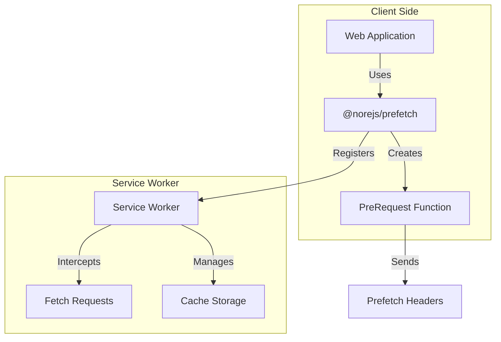

# Prefetch

🚀 **Cross-Application Data Prefetching Solution**

[](https://www.npmjs.com/package/@norejs/prefetch)
[](https://opensource.org/licenses/MIT)
[](https://www.typescriptlang.org/)

[English](README.md) | [中文](README.zh-CN.md)

## 🎯 What is Prefetch?

Prefetch is an intelligent data prefetching solution that leverages Service Workers to cache API requests and provide instant responses. It significantly improves user experience by preloading data before users actually need it.

## ✨ Key Features

- 🔄 **Request Deduplication**: Automatically merges concurrent identical requests
- 📦 **Intelligent Caching**: Unified caching mechanism for prefetch and normal requests  
- ⚡ **Performance Optimization**: Promise-level request reuse
- 🎛️ **Flexible Configuration**: Support for message-based initialization and default configuration
- 🔧 **Dynamic Interception**: Fetch event listeners registered during script initialization with dynamic handling
- 🐛 **Developer Friendly**: Detailed logging and debugging support
- 🌐 **Cross-Application**: Support for multi-application scenarios
- ⚛️ **React Integration**: Built-in React components and hooks

## 📊 Comparison with React Query/SWR

| Feature | **Our Solution** | React Query/SWR |
|---------|------------------|------------------|
| **Primary Focus** | API data prefetching | Data fetching & caching |
| **Implementation** | Service Worker + unified API | Client-side hooks |
| **Caching Strategy** | Multi-level intelligent cache | Memory + optional persist |
| **Request Deduplication** | ✅ Automatic | ✅ Built-in |
| **Cross-Origin Support** | ✅ With configuration | ✅ Built-in |
| **Framework Agnostic** | ✅ Any framework | ❌ React/Vue specific |
| **Data vs Resources** | ✅ API data focused | ✅ Data focused |
| **Cache Persistence** | ✅ Service Worker cache | 🟡 Memory/localStorage |
| **Offline Support** | ✅ Built-in | ❌ Additional setup |
| **Cross-App Sharing** | ✅ Built-in | ❌ App-specific |
| **Promise Sharing** | ✅ Automatic | ✅ Per-hook |

### 🏆 Key Advantages

1. **🎯 Purpose-Built for APIs**: Unlike general-purpose solutions, specifically designed for API data prefetching
2. **🌐 Cross-Application Data Sharing**: Share cached data between different applications on the same domain - a unique capability that React Query/SWR cannot provide
3. **🔄 Smart Deduplication**: Automatically prevents duplicate requests and shares promises across the application
4. **⚡ Zero Configuration**: Works out of the box with sensible defaults, no complex setup required
5. **📦 All-in-One Solution**: No need to combine multiple libraries - everything you need in one package
6. **🔧 Service Worker Power**: Leverages SW capabilities for true network-level caching and offline support

### 🤔 When to Choose Our Solution

**Choose Prefetch when you need:**
- Cross-application data sharing (multiple apps on the same domain)
- Framework-agnostic solution (not limited to React/Vue)
- True offline support with Service Worker caching
- Network-level request deduplication
- Minimal setup complexity

**Consider React Query/SWR when:**
- Building React-only applications
- Need complex state management features
- Prefer client-side only solutions
- Require extensive ecosystem of plugins

## 📦 Architecture

Prefetch is a unified solution that includes:

- **Service Worker Management**: Automatic registration and lifecycle handling
- **Prefetch API**: Simple `preFetch()` function for data prefetching
- **React Integration**: Built-in `PrefetchLink` component
- **Intelligent Caching**: Automatic request deduplication and cache management
- **Configuration**: Flexible setup with sensible defaults



## 🚀 Quick Start

### Installation

```bash
# Install Prefetch (includes everything you need)
npm install @norejs/prefetch
```

### Setup Service Worker

```bash
# Copy service worker file to your public directory
npx prefetch install --dir public
```

### Basic Usage

```typescript
import { setup, preFetch } from '@norejs/prefetch'

// Initialize the prefetch solution
await setup({
  serviceWorkerUrl: '/service-worker.js',
  scope: '/',
  apiMatcher: '\/api\/*',           // API matching pattern
  defaultExpireTime: 30000,     // Default cache expiration (30s)
  maxCacheSize: 100,            // Maximum cache entries
  debug: true                   // Enable debug mode
})

// Prefetch data directly
await preFetch('/api/products', {
  expireTime: 30000  // Custom expiration time
})

// Regular fetch will use cached data if available
const response = await fetch('/api/products')
```

### React Integration

```jsx
import { PrefetchLink } from '@norejs/prefetch'

function App() {
  return (
    <PrefetchLink appUrl="https://example.com">
      <a href="/products">Products</a>
    </PrefetchLink>
  )
}
```

## ⚙️ Configuration Options

| Option | Type | Default | Description |
|--------|------|---------|-------------|
| `serviceWorkerUrl` | `string` | - | Path to service worker file |
| `scope` | `string` | `'/'` | Service worker scope |
| `apiMatcher` | `string \| RegExp` | `'/api'` | API request matching pattern |
| `defaultExpireTime` | `number` | `0` | Default cache expiration (milliseconds) |
| `maxCacheSize` | `number` | `100` | Maximum cache entries |
| `debug` | `boolean` | `false` | Enable debug logging |

## 🔍 How It Works

### 1. Dynamic Interception Mechanism

```typescript
// Service Worker registers fetch listener during script evaluation
self.addEventListener('fetch', function (event) {
    if (!isInitialized || !handleFetchEventImpl) {
        return; // Don't intercept
    }
    // Dynamically call handler function
    event.respondWith(handleFetchEventImpl(event));
});

// Handler function is set during initialization
handleFetchEventImpl = setupWorker(config);
```

### 2. Intelligent Caching Strategy

**Supported HTTP Methods:**
- ✅ **GET**: Query operations, ideal for caching
- ✅ **POST**: Submit operations, supports request deduplication
- ✅ **PATCH**: Update operations, supports caching
- ❌ **DELETE**: Delete operations, never cached

### 3. Request Deduplication

```typescript
// Two-level cache design
type ICacheItem = {
    expire: number;
    response?: Response;        // Completed response
    requestPromise?: Promise<Response>; // In-progress request
};
```

**Cache Flow:**
1. **Cache Hit**: Return cached Response immediately
2. **Promise Reuse**: Multiple identical requests share same Promise
3. **New Request**: Create new network request and cache Promise

### 4. Prefetch Headers

Prefetch requests are identified by special headers:
```
X-Prefetch-Request-Type: prefetch
X-Prefetch-Expire-Time: 30000
```

## 📊 Performance Benefits

1. **First Visit**: Prefetch loads data in background
2. **Subsequent Visits**: Instant data from cache
3. **Smart Caching**: Avoids duplicate requests and storage
4. **Auto Cleanup**: Prevents unlimited cache growth

## 🛠️ Advanced Usage

### Custom Request Matching

```typescript
await setup({
  serviceWorkerUrl: '/service-worker.js',
  apiMatcher: /\/api\/v[12]\//,  // Match /api/v1/ and /api/v2/
  // ... other options
})
```

### Manual Service Worker Messages

```typescript
// Send initialization message manually
navigator.serviceWorker.controller.postMessage({
  type: 'PREFETCH_INIT',
  config: {
    apiMatcher: '/api/v1',
    defaultExpireTime: 60000,
    maxCacheSize: 200,
    debug: false
  }
})
```

## 🧪 Demo Projects

We provide complete demo projects to showcase the prefetch solution:

```bash
# Install dependencies for all demos
npm run demo:install

# Copy service worker files (uses the new unified CLI)
npm run demo:copy-sw

# Run API server
npm run demo:api

# Run Next.js demo
npm run demo:nextjs

# Run Vite demo  
npm run demo:vite

# Run all demos simultaneously
npm run demo:start:all
```

**Note**: The demo projects use the new unified `prefetch` CLI command, demonstrating the simplified installation process.

Visit:
- **API Server**: http://localhost:3001
- **Next.js Demo**: http://localhost:3000  
- **Vite Demo**: http://localhost:5173

## ⚠️ Important Notes

1. **HTTPS Requirement**: Service Workers only work over HTTPS (localhost excepted)
2. **Browser Support**: Requires modern browsers with Service Worker support
3. **Same-Origin**: Prefetch only works for same-origin requests
4. **Cache Limits**: Default maximum of 100 cached requests

## 🤝 Contributing

We welcome contributions! Please see our [Contributing Guide](CONTRIBUTING.md) for details.

## 📄 License

This project is licensed under the MIT License - see the [LICENSE](LICENSE) file for details.

## 📚 Additional Resources

- [API Documentation](docs/API.md)
- [Migration Guide](MIGRATION.md)
- [Performance Benchmarks](docs/BENCHMARKS.md)
- [Troubleshooting](docs/TROUBLESHOOTING.md)

## 🔗 Related Projects

- [Service Worker API](https://developer.mozilla.org/en-US/docs/Web/API/Service_Worker_API)
- [Fetch API](https://developer.mozilla.org/en-US/docs/Web/API/Fetch_API)
- [Web App Manifest](https://developer.mozilla.org/en-US/docs/Web/Manifest)